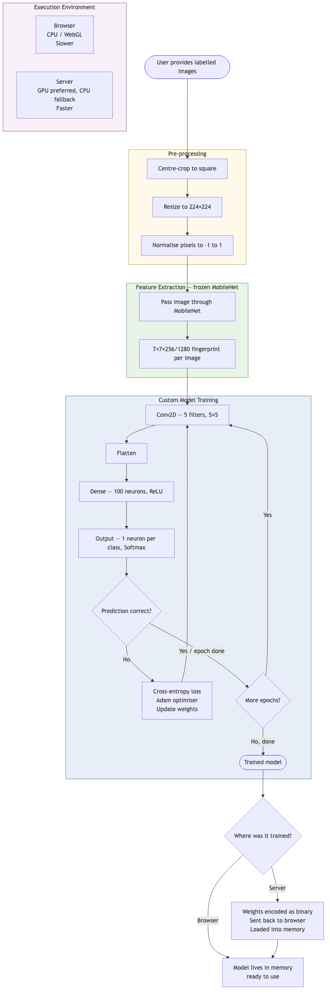

# WB PIC
An offline version of the Personal Image Classification website, to be used with MIT App Inventor's personal image classifier extension or as a standalone website.

## Folder Structure
The `mobilenet` folder contains shards and model.json file for v1 of mobilenet.
The `mobilenetv2` folder contains shards and model.json file for v2 of mobilenet.
The `newpic` folder contains the sources for the React app to perform training and testing for the Personal Image Classifier website.
The server version of the training functionality is in the `newpic/server` folder and it contains its own npm package


## Architecture
### Front end
A React app is the main building block of the UI for this site.


### Server mode
An optional nodejs, expresjs app can be run to take on higher loads of training data.


PIC has two training modes, directly on the browser or delegated to a server.

The server will load a different package depending on if it can detect a GPU or not. If it is detected, the GPU will be used for training and if not, it will default to CPU.

## How Training Works

The system trains an **image classifier** using **transfer learning**: it borrows a pre-built neural network (MobileNet, developed by Google) as a frozen feature extractor, and trains a small custom layer on top. MobileNet acts as a highly-trained eye that describes what it sees; the custom layer learns what to *call* those descriptions based on your specific categories.

### Training Pipeline

1. **You provide examples** — images grouped by label (your chosen categories).
2. **Images are pre-processed** — centre-cropped, resized to 224×224 pixels, pixel values normalised to [-1, 1].
3. **MobileNet extracts features** — every image is passed through the frozen MobileNet network, producing a compact numerical fingerprint. MobileNet's weights never change.
4. **A small custom model trains on those fingerprints** — 4 layers: Conv2D → Flatten → Dense (100 neurons) → Output (one neuron per class, Softmax).
5. **Loss and optimisation** — predictions are compared to correct labels via categorical cross-entropy loss; the Adam optimiser adjusts weights to reduce error. Repeats for ~20 epochs.
6. **Result** — a trained model file ready to classify new images.

### Browser vs Server: Same Training, Different Environment

The training logic is **identical** in both modes — same architecture, same loss function, same optimiser, same image normalisation, same TensorFlow.js training loop. The difference is purely where the computation runs:

| | Browser | Server |
|---|---|---|
| Hardware | CPU / WebGL | GPU (with CPU fallback) |
| Speed | Slower | Much faster |
| Flow | Synchronous, in memory | Job submitted → polled → model returned |

In server mode the browser submits images and config, the server trains in the background, and when done the model weights are sent back and loaded into the browser — ready to use exactly as if trained locally.



**Key defaults:** MobileNet v1 or v2 · 224×224 input · Adam lr=0.0001 · 20 epochs · batch size ~40% of dataset · optional 80/20 stratified validation split.

## Development
Both the React app and the server have their own set of dependencies and npm files.

Each of these sets must be installed with:
```bash
npm install
```

Each of them can be started for development (hot reload) with:
```bash
npm start
```


## Deployment
There are a number of ways that this software can be deployed.

### Standalone, in browser only app
This mode can be deployed by simply serving the files from the output of `npm build` on any web server such as Apache or Nginx.

### Browser and Server training
This mode needs nodejs installed in the server machine. The sources in the `newpic/server` folder can be run with the node command; it is an expressjs app.
Running in server mode also means that the React app or front end could be served as static assets from the same node server.

For production the recommended setup would be nginx as reverse proxy serving the app as statis aseets and the node app in a local port. Docker images can also be generated.


## App Specifics - Training Settings

The app also allows to load models from a URL if connectivity is available.
